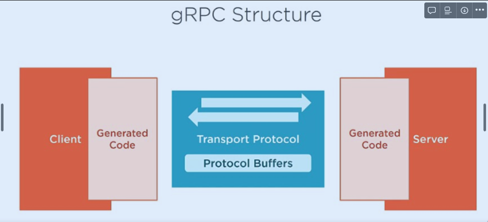
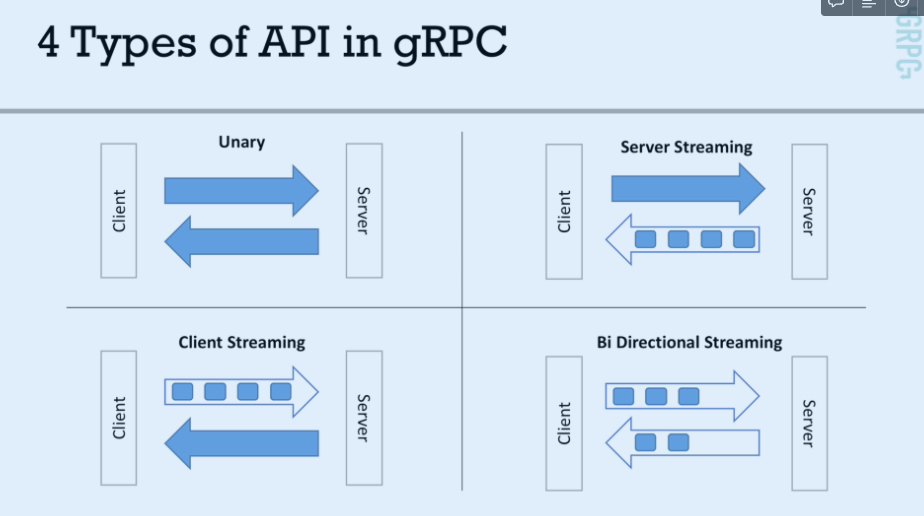

# Grpc

- [概念](#概念)
  - [連線類型](#連線類型)
  - [資料型別](#資料型別)

- Install the protocol compiler plugins for Go using the following command
```shell
go install google.golang.org/protobuf/cmd/protoc-gen-go@v1.28
go install google.golang.org/grpc/cmd/protoc-gen-go-grpc@v1.2
```

## 概念
- gRPC 是建立在HTTP/2上的通訊協定，gRPC 可以protocol buffers定義訊息的格式，gRPC 可以使用任何語言實作。

- 資料傳送的時候是message binary format，該數字是用來定位該欄位。而數字1-15 是只用了 1 byte encode， 16-2047 用了 2 btyes encode ，所以建議常用的欄位可以放在前 15 個欄位，可以多少減少一些資料的傳送量。
### 連線類型

- Unary：類似傳統 API，client 發送 request 而 server 回傳 response
- Server Streaming：透過 HTTP/2，client 發送一次 request，而 server 可以回傳多次資料
- Client Streaming：client 發送多次資料，直到告知 server 資料傳完後，server 再給予 response
- Bi Directional Streaming：兩邊都用串流的方式傳送資料
### 資料型別
- 以下是 proto3 的一些基本資料類型：
- 雙精度浮點數: double
- 單精度浮點數: float
- 整數:
  - int32: 32位有符號整數
  - int64: 64位有符號整數
  - uint32: 32位無符號整數
  - uint64: 64位無符號整數
  - sint32: 使用ZigZag編碼的32位有符號整數（適用於負數）
  - sint64: 使用ZigZag編碼的64位有符號整數
- 固定大小的整數:
  - fixed32: 32位無符號整數
  - fixed64: 64位無符號整數
  - sfixed32: 32位有符號整數
  - sfixed64: 64位有符號整數
- 布爾值: bool
- 字符串: string: 一個UTF-8編碼的字符串
- 字節序列: bytes: 任意序列的字節
- 複合資料類型:
  - enum: 用於定義一個命名的枚舉值集合。
  - message: 定義一個結構化的數據類型，可以包含多個字段。
  - repeated: 用於表示一個字段可以有多個值。
  - map: 一個鍵值對集合。例如: map<string, int32> name_to_id;
## Recap
- protobuf 比 json 小，並且傳輸更快，我認為光這點就值得考慮用這個取代restful api
- grpc有四種類型, 基本上可以應用在很多業務情境
- 實際上操作，一開始定義好proto, 然後command line generate code, 然後實作跟啟動code

## Todo
- 研究keepAlive, 雙工模式server可以傳資料, client可以傳資料, 實作一個server 每五秒說安安, client 說 ping , server 回 pong, 不是ping, 回hello
- grpc 有驗證機制嗎? 目前我拿到client就直接打到server 拿response了，但是我想要server收到client的請求時，驗證token? how?
- 了解option, 關於server端跟client端, 他都有一些option機制, 有哪些是應用?

## Reference
[gRPC structure](https://mileslin.github.io/2020/03/Golang/%E7%94%A8-GO-%E5%BB%BA%E7%AB%8B-gRPC-%E7%9A%84-Server-%E8%88%87-Client/)

[官方文件](https://grpc.io/docs/languages/go/quickstart/)